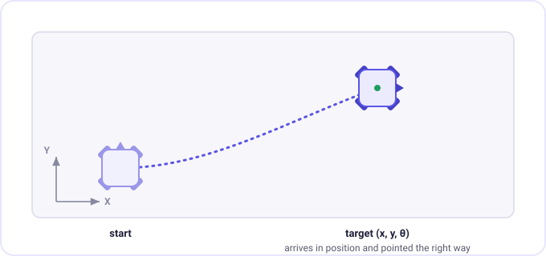
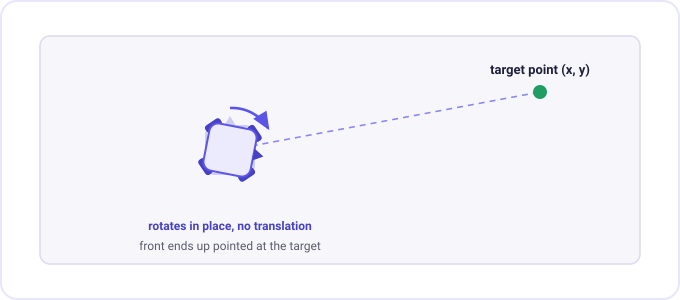
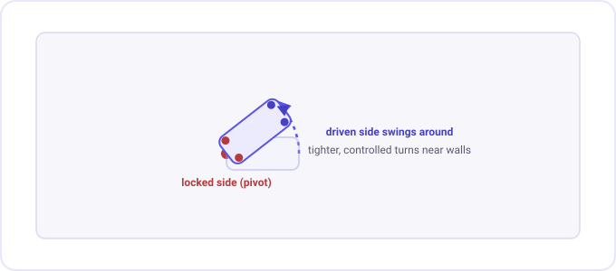
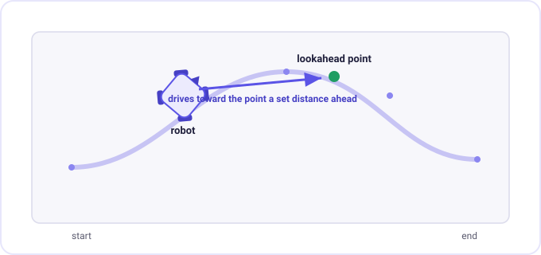
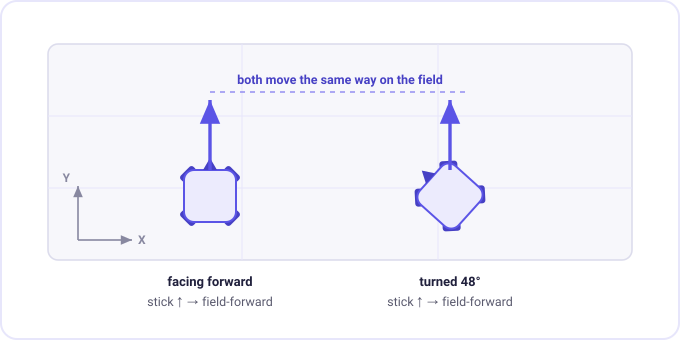
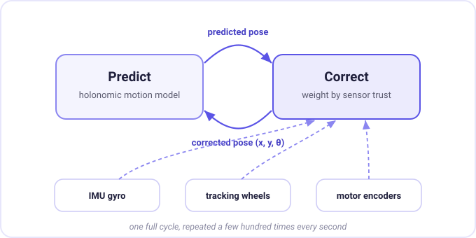
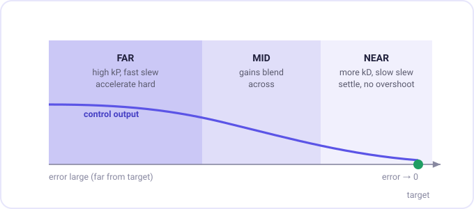
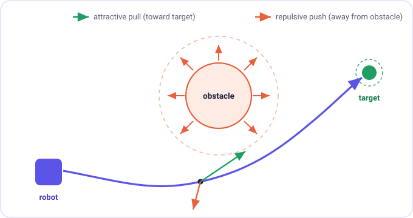

# Usage Guide

This is the practical companion to the overview. The front page explains *what*
each system does; this page is about *how* to actually use it on your robot, with
the functions you'll call, code you can copy, and the reasoning behind the knobs
you'll end up turning.

If you're just getting started, read the setup section top to bottom. After that,
treat the rest like a reference, jump to the part you need.

[TOC]

---

## Setup and tuning

HoloLib is built out of a few objects that hand work to each other rather than
one big class. You create them at global scope in `main.cpp`, and the motion
functions pick them up from there.

The names matter. `include/hololib/config.hpp` declares this exact set as
`extern`, and every motion function defaults to them, so if you rename one or
skip it the project won't link:

```cpp
#include "main.h"
#include "hololib/chassis.hpp"
#include "hololib/config.hpp"
#include "hololib/localization/odometry.hpp"
#include "hololib/motions/motions.hpp"
#include "hololib/util/GainScheduler.hpp"

pros::Motor frontLeft(-3, pros::MotorGear::blue);
pros::Motor frontRight(2, pros::MotorGear::blue);
pros::Motor backLeft(-4, pros::MotorGear::blue);
pros::Motor backRight(1, pros::MotorGear::blue);
pros::Imu imu(10);

hololib::ChassisConfig chassis_config = {
  .drivetrainWidth  = 9.1,    // inches
  .drivetrainLength = 10.25,  // inches
  .wheelDiameter    = 3.25,   // inches
  .gearRatio        = 0.5     // wheel rotations per motor rotation
};

hololib::EncoderEKFOdometry odom(frontLeft, frontRight, backLeft, backRight, imu, chassis_config);
hololib::Chassis chassis(frontLeft, frontRight, backLeft, backRight, imu, odom);

hololib::GainScheduler xSched, ySched, thetaSched;
hololib::ObstacleManager obstacles;

const std::function<hololib::Pose(bool)> poseGetter = [](bool radians) { return odom.getPose(radians); };
```

Note that `odom` has to exist before `chassis`, because the chassis holds a
reference to it.

Get the motor directions right when you build them. A negative port number
reverses that motor, which is how the example above flips the left side. If a
movement runs away in the wrong direction, a motor sign is the first thing to
check.

Then calibrate once at the start of the match and start the odometry task,
before you try to drive anything:

```cpp
void initialize() {
  chassis.calibrate();   // resets and waits out the IMU calibration
  odom.startTask();      // spawns the tracking task (10 ms period by default)
}
```

`calibrate()` blocks until the IMU finishes settling and the robot has to sit
still while it does, so call it in `initialize()`, not right before a move. It
rumbles the controller when it's done.

### How the axes are laid out

Before you tune anything, know what the controllers are working on. HoloLib runs
three independent PID controllers, each fed by its own gain scheduler:

| Scheduler | Controls | Error is measured in |
| --- | --- | --- |
| `xSched` | strafing (left/right) | inches |
| `ySched` | forward/back | inches |
| `thetaSched` | heading | degrees |

So `xSched` tunes your sideways movement and `ySched` tunes your forward
movement. On a symmetric X-drive these usually end up close to each other, but
they're separate so you can tune them separately if the robot behaves
differently strafing than it does driving straight.

### Setting gains

Each scheduler takes its gains through `setGains`. It doesn't take a single set
of numbers, it takes a *schedule* (more on why in
[Gain scheduling](#gain-scheduling)). For now, the short version: each line is
`{error threshold, {kP, kI, kD}}`, and the controller picks gains based on how
far it still has to go.

```cpp
void initialize() {
  chassis.calibrate();
  odom.startTask();

  // {error threshold, {kP, kI, kD}}
  xSched.setGains({
      {36.0, {15, 0, 2.4}},   // far away: get moving
      {0.0,  {25, 0, 0.5}}    // dialed in: settle gently
  });
  ySched.setGains({
      {36.0, {15, 0, 1.6}},
      {0.0,  {20, 0, 1.5}}
  });
  thetaSched.setGains({
      {90.0, {2.76411f, 0.0116046f, 0.0384008f}},
      {0.0,  {3.0f, 0.0f, 0.04f}}
  });
}
```

If you don't want to deal with scheduling yet, just give each one a single line
with a threshold of `0.0`. That's a plain, fixed PID and it's a perfectly good
place to start.

There's also `addStep(threshold, kP, kI, kD, slew)` if you'd rather build the
schedule one line at a time. `setGains` is written on top of it.

Two things worth knowing about the schedule entries. `ScheduledGain` holds a
`PIDGains`, which has a `kF` field, but the scheduler drops it, so only `kP`,
`kI`, `kD`, and `slew` survive into the running controller. And you can pass a
fifth number for the slew rate, which is carried through and interpolated like
the rest.

### How to actually tune the PIDs

There's no shortcut here, you tune by watching the robot and adjusting. The order
that saves the most headaches:

1. **Theta first.** A robot that can't hold its heading will fight every
   translation move, so get turning solid before anything else. Use
   `turnToHeading(90)` as your test.
2. **Then Y (forward), then X (strafe).** Test Y with `moveDistance(24)` and X
   with `strafeDistance(24)`.

For each one, the loop is the same:

- Start with only **kP**. Raise it until the robot reaches the target quickly
  and overshoots just a little, a small bounce is what you want here.
- Add **kD** to take the bounce out. kD fights sudden change, so it damps the
  overshoot. Push it until the move stops cleanly without getting twitchy.
- Only add **kI** if the robot consistently stops *just short* of the target and
  sits there. A little goes a long way, and too much makes it wind up and
  overshoot. Most moves don't need much kI at all.
- **slew** is polish. It limits how fast the output can jump, which smooths out
  the start of a move so you're not slamming the motors from zero.

The PID controller has a few extra features once you outgrow the basics:
sign-flip reset (dumps the integral when you cross the target so it doesn't
carry stale windup), an integral limit, a windup range, and a filtered
derivative. The motion functions build their controllers internally so you don't
normally reach for these, but they're documented in
[PID.hpp](../include/hololib/util/PID.hpp) if you're writing your own motion.

### Movement parameters

Every autonomous function takes a `MoveParams` as its last real argument. This is
how you control speed, accuracy, and when a move is allowed to give up:

```cpp
hololib::MoveParams params {
  .angleCorrection     = true,    // face the direction of travel while driving
  .maxTranslationSpeed = 110.0f,  // cap translation output (0-127)
  .maxRotationSpeed    = 90.0f,   // cap rotation output
  .minSpeed            = 12.0f,   // floor so it doesn't stall crawling in
  .exitRange           = 1.0f,    // "close enough" distance to finish
  .earlyExitRange      = 0.0f,    // bail out this far from the target
  .timeout             = 4000     // hard stop after this many ms
};

hololib::moveToPoint(24, 24, params);
```

A few of these earn their keep:

- **`timeout`** is your safety net. If a move can't settle (stuck on a wall, bad
  tune), it ends here instead of hanging your whole routine. It defaults to
  5000 ms.
- **`exitRange`** is the accuracy/speed trade. Tighter means more precise but the
  robot spends longer fussing at the end. Defaults to 0.5 inches.
- **`earlyExitRange`** lets a move end before it fully settles, handy when you
  want to flow straight into the next move without stopping dead. Left at `0.0`
  it's off.
- **`minSpeed`** keeps the robot from stalling out as the error shrinks and the
  PID output falls off. Note that the motions stop applying it once you're
  inside the exit range, so it won't fight the settle.

There's no global default you can set. If you use the same parameters
everywhere, make one `MoveParams` at file scope and pass it into each call.

---

## Motion functions

These are the autonomous moves. They live in the `hololib` namespace as plain
functions, not chassis methods, so you call them directly:

```cpp
hololib::moveToPoint(24, 24);
```

Called like that they **block** until the move finishes. To run one through the
motion handler instead, wrap it in the `chassisAsync` macro:

```cpp
chassisAsync(hololib::moveToPoint(24, 24));
```

See [The motion handler](#the-motion-handler) for what that actually buys you,
it's a little different from the async you might expect.

Each function also takes a trailing `MoveSettings` you'll almost never pass. It
defaults to the global objects from your `main.cpp`, and exists so you can swap
in different motors, schedulers, or a different pose source when you want to.

### moveToPoint

Drives to an (x, y) coordinate. By default it also rotates to face the point as
it goes, which keeps the front of the robot pointed where it's headed. Set
`angleCorrection` to `false` in the params if you want to hold your current
heading and just slide over there instead.

```cpp
hololib::moveToPoint(36, 24);                              // drive there, facing the point
hololib::moveToPoint(36, 24, {.angleCorrection = false});  // drive there, keep current heading
```

It stops correcting heading in the last two inches so the robot isn't spinning
while it tries to settle on the spot.

### moveToPose

Like `moveToPoint`, but you also tell it the exact heading to finish at. It works
the translation and the rotation at the same time, so it arrives in position
*and* pointing the right way, instead of driving there and then turning.

```cpp
hololib::moveToPose(48, 24, 90.0f);   // end at (48, 24), facing 90 degrees
```



Use this when the *next* thing you do depends on your heading, lining up on a
goal, scoring, handing off into a turn-free path. It won't call itself done
until both the position is inside `exitRange` and the heading is within two
degrees.

### moveRelative, moveDistance, strafeDistance

These move relative to where the robot is right now, instead of to an absolute
field coordinate. `moveRelative` takes a forward and a sideways distance at once;
`moveDistance` and `strafeDistance` are thin wrappers over it for the
straight-line cases.

```cpp
hololib::moveDistance(18);          // 18 inches forward
hololib::moveDistance(-12);         // 12 inches back
hololib::strafeDistance(10);        // 10 inches sideways
hololib::moveRelative(18, 10);      // forward and sideways together (diagonal)
```

By default they hold your starting heading the whole way (`holdHeading = true`,
the argument right after the distances), so the robot tracks straight instead of
drifting off-angle. These are great for short, predictable adjustments where you
don't want to think in field coordinates.

### turnToHeading and turnToPoint

`turnToHeading` rotates in place to an absolute heading. `turnToPoint` rotates in
place until the front faces a coordinate, it figures out the angle for you.

```cpp
hololib::turnToHeading(180.0f);   // face straight back
hololib::turnToPoint(0, 0);       // face the field origin, wherever you are
```



`turnToPoint` is the one you want for aiming, point at a goal or a target before
you shoot or score, without having to do the trig yourself. Both check that the
error has actually stopped changing before they call it done, so you don't fire
off the next move while the robot is still drifting.

For turns, `exitRange` and `earlyExitRange` are in degrees, not inches. The
default `exitRange` of 0.5 is a tight turn tolerance, so loosen it if your turns
sit there hunting.

### swingTurn

A swing turn drives one side of the drive harder than the other so the robot
sweeps through an arc instead of spinning around its center. Pass which side to
pivot around:

```cpp
hololib::swingTurn(90.0f, hololib::SwingSide::Left);    // pivot around the left side
hololib::swingTurn(90.0f, hololib::SwingSide::Right);
```



This is useful when you're tucked against a wall or working in a corner and a
center pivot would put a corner of the robot into something.

### followPath

This is the big one. You give it a list of points and it follows the whole path
smoothly, instead of stopping at each point like a chain of `moveToPoint` calls.

It works on a *lookahead*: instead of aiming at the nearest point, it aims at a
point a fixed distance ahead on the path. Picture driving by looking down the
road a bit rather than at your own bumper, that's what keeps the motion smooth
and stops the robot from snapping corner to corner. That lookahead distance is
the second argument, in inches.



Unlike the other motions, `followPath` has no default arguments before
`MoveParams`, so you spell out the heading mode, the hold angle, and the
reversed flag every time:

```cpp
std::vector<hololib::PathPoint> path = {
  {0,  0,  0},
  {12, 18, 0},
  {30, 24, 0},
  {48, 24, 0}
};

// path, lookahead, heading mode, hold angle, reversed
hololib::followPath(path, 8.0f, hololib::HeadingMode::FollowPath, 0.0f, false);
```

The `headingMode` argument decides where the robot points while it drives the
path:

- **`HeadingMode::FollowPath`**, the front follows the direction of travel, so
  the robot "drives like a car" along the curve.
- **`HeadingMode::HoldAngle`**, lock to one heading for the whole path and pass
  the angle in `holdAngleDeg`. The robot keeps facing one way while it traces the
  shape, which an X-drive can do and a tank drive can't.
- **`HeadingMode::CustomAngles`**, use the `theta` you stored in each `PathPoint`,
  so you control the heading point by point.

```cpp
hololib::followPath(path, 8.0f, hololib::HeadingMode::HoldAngle, 45.0f, false);
```

Set the `reversed` argument to `true` to drive the path backwards. A couple of
practical notes: tuning the lookahead matters, too short and it wobbles trying to
hug the line, too long and it cuts corners. Start around 6-10 inches and adjust.
And you need at least two points, it returns immediately otherwise.

You can build paths by hand like above, or design them in the simulator
(`tools/sim_auton.py`) and paste the result in.

### Driver control

For the opcontrol period, `chassis.driveControl` maps joystick inputs to the
drive. This one *is* a chassis method, since it's driving the wheels directly
rather than running a motion. The `fieldCentric` argument turns on
**field-centric** mode, where pushing the stick "forward" always moves toward the
same end of the field no matter which way the robot is currently facing.



```cpp
void opcontrol() {
  pros::Controller master(pros::E_CONTROLLER_MASTER);

  hololib::Chassis::DriveCurve movement_curve{.curve_multipler = 1.01, .deadzone = 5, .minimum_output = 5};
  hololib::Chassis::DriveCurve rotation_curve{.curve_multipler = 1.028, .deadzone = 5, .minimum_output = 5};

  while (true) {
    chassis.driveControl(
      master.get_analog(ANALOG_LEFT_Y),    // forward / back
      master.get_analog(ANALOG_LEFT_X),    // strafe
      master.get_analog(ANALOG_RIGHT_X),   // rotate
      {.movement = movement_curve, .rotation = rotation_curve},
      true,   // field-centric
      0.0f,   // heading offset
      {.correctionOn = true, .kP = 0.15f, .kI = 0.01f, .kD = 0.01f}
    );
    pros::delay(20);
  }
}
```

All seven arguments are required, there are no defaults on this one.

The `DriveCurve`s shape the stick response. The deadzone kills drift near center,
`minimum_output` is the floor once you're past the deadzone so the wheels
actually break loose, and the curve multiplier makes small inputs gentler for
fine control while still letting you floor it. The `DriveCorrection` holds your
heading when you let go of the turn stick, so the robot doesn't slowly rotate off
course while you're just translating.

Field-centric relies on the IMU heading. If you skipped `calibrate()` or the IMU
drifts, "forward" will drift with it. The `headingOffset` redefines which way
"forward" points, for example to match your driver's view from across the field.

There's also `chassis.drive(vx, vy, omega, theta)` if you want to command the
drive directly with no curves or correction in the way, and `chassis.brake()`.

---

## The motion handler

The `chassisAsync` macro hands your motion to `hololib::motion_handler`, a single
background task that runs one motion at a time:

```cpp
#define chassisAsync(f) hololib::motion_handler::move([&] { f; });
```

Here's the part worth understanding, because it's easy to misread. `move()` takes
a mutex that the running motion holds. So if you write two moves back to back,
the *second `chassisAsync` call itself blocks* until the first motion finishes:

```cpp
chassisAsync(hololib::moveToPoint(24, 24));   // returns right away, motion starts
chassisAsync(hololib::moveToPose(48, 24, 90)); // waits here until the first is done
std::println("both done");                     // ...so this prints at the end
```

There's no queue holding pending motions. What you get is one motion running in
the background while your code keeps going, up until you ask for another one.

That's still useful. The window between starting a motion and requesting the next
is yours, so you can run an intake, raise a lift, or poll a sensor while the
robot drives:

```cpp
chassisAsync(hololib::moveToPoint(48, 0));
intake.move(127);                 // runs while the robot is still driving
pros::delay(500);
intake.brake();

hololib::motion_handler::waitUntilDone();   // now wait for the drive to finish
```

The full set of functions:

- **`waitUntilDone()`**, block until the running motion finishes. This is your
  main tool for "do this move, then continue."
- **`isMoving()`**, whether a motion is running right now.
- **`cancel()`**, stop the motion that's running. It notifies the task, and the
  motion breaks out of its loop on its next iteration, so give it a few
  milliseconds before you count on it being stopped.
- **`move(motion, priority)`**, what `chassisAsync` calls. The optional second
  argument sets the task priority for that motion.

Motions also cancel themselves if the competition state changes mid-move, so a
routine won't keep driving into the next period.

---

## The Pose EKF

Odometry is the robot knowing where it is. The naive way, count wheel rotations
and add them up, drifts: a wheel slips, a sensor reads noisy, tiny errors stack,
and after a few seconds the robot's idea of its position has wandered off from
reality. The `PoseEKF` (Extended Kalman Filter) fixes that by refusing to trust
any one sensor on its own.

### How it works

The filter tracks your X, Y, and heading, and runs two steps over and over, once
per odometry tick:

1. **Predict.** Using how much the wheels moved this tick, it works out where the
   robot *should* be now, using the holonomic motion model, so curved motion gets
   estimated correctly.
2. **Correct.** It compares that prediction against what the sensors actually
   read, the IMU for heading, tracking wheels or encoders for position, and
   nudges its estimate toward whichever source it trusts more.



"How much it trusts each source" is the whole game, and it's set by *noise*
values. Process noise is how much you distrust the motion model's prediction;
measurement noise is how much you distrust the sensors. The filter weighs them
against each other automatically every tick.

### Using it

The odometry task runs on a 10 ms period by default. Pass a different one to
`startTask` if you want:

```cpp
odom.startTask();      // 10 ms
odom.startTask(20);    // 20 ms
```

The EKF is on by default. You can turn it off and fall back to plain odometry,
which is worth doing while you tune everything else:

```cpp
odom.setKalmanFilterEnabled(false);   // raw odometry, no filtering
odom.setKalmanFilterEnabled(true);    // filtering back on
```

Reading and writing the pose goes through the odometry object. `getPose` takes a
bool for the units, and `setPose` always takes degrees:

```cpp
odom.setPose(0, 0, 90);                   // x, y, theta in degrees

hololib::Pose pose = odom.getPose(false); // false = degrees, true = radians
std::println("{}, {}, {}", pose.x, pose.y, pose.theta);
```

`setPose` also writes the heading straight to the IMU, so it's a real reset, not
just a bookkeeping change.

Turning on velocity calculations fills in the `velocity` member of the pose,
which is handy when you're writing your own motions:

```cpp
odom.setVelocityCalculations(true);
hololib::Pose p = odom.getPose(false);
// p.velocity.vx, p.velocity.vy, p.velocity.w
```

If you have dedicated tracking wheels (unpowered wheels on rotation sensors),
register them. This is the single biggest accuracy upgrade you can give odometry,
since they don't slip the way driven wheels do:

```cpp
odom.addTrackingWheel({
  .port          = 7,
  .orientation   = hololib::TrackingWheelOrientation::VERTICAL,
  .xOffset       = 0.0f,
  .yOffset       = 1.5f,
  .wheelDiameter = 2.75f,
  .gearRatio     = 1.0f
});
```

Adding one switches the position half of the filter over to the tracking wheels
and tightens the measurement noise to match. `clearTrackingWheels()` puts it back
on the motor encoders.

The EKF is the hardest part of the library to tune, and a badly tuned filter is
*worse* than no filter, it'll confidently report the wrong position. If you're
not comfortable with noise values yet, run with `setKalmanFilterEnabled(false)`
and come back to it. Get your movements working on plain odometry first.

### Resetting from distance sensors

Odometry drift is cumulative, so if you have distance sensors pointed at walls
you can snap the position back to truth mid-routine. `DistanceReset` works out
where you must be from the wall readings:

```cpp
pros::Distance front(11), left(12);

hololib::DistanceReset reset({
  {front, 6.0, 0.0,  0.0},    // sensor, forward offset, strafe offset, mounting angle
  {left,  0.0, 6.0, 90.0}
});

reset.update(true);   // true = write the result straight into odometry
```

It only trusts a sensor that's roughly square to a wall (within 40 degrees by
default) and inside range, and it filters out readings that disagree with the
current odometry by more than a few inches. Whichever axis it can't solve for
keeps the odometry value, and the returned `distancePose` tells you which was
which through `using_odom_x` and `using_odom_y`.

---

## Gain scheduling

One PID tune can't be good at everything. Tune it to sprint across the field and
it overshoots on small moves. Tune it to settle gently on small moves and it
crawls across long ones. Gain scheduling is the way out: instead of one set of
gains, you define several, each tied to a range of error, and the controller
blends between them as the robot closes in.

### How the schedule reads

Every entry is `{threshold, {kP, kI, kD}}`, with an optional fifth number for the
slew rate. The `threshold` is an error level, how far you still are from the
target, in inches for X/Y or degrees for theta. The controller looks at the
current error and:

- below your smallest threshold, it uses that entry's gains,
- above your largest threshold, it uses that entry's gains,
- anywhere in between, it **linearly interpolates** between the two surrounding
  entries, so the gains slide smoothly instead of snapping.

That interpolation is the important part, there's no jarring handoff where the
robot lurches as gains change. The slew rate scales right along with everything
else.



The scheduler works on the absolute value of the error, so you only ever write
positive thresholds and both directions get the same treatment.

### Setting it up

```cpp
ySched.setGains({
    {24.0, {9.0, 0.0,  0.6, 0.0, 8.0}},   // far: push hard, fast slew
    {6.0,  {7.5, 0.0,  0.8, 0.0, 6.0}},   // mid: ease off
    {0.0,  {6.0, 0.02, 1.0, 0.0, 3.0}}    // close: gentle, no overshoot
});
```

The fourth number in each set is `kF`, which the scheduler discards, so pass
`0.0` there and put your slew rate fifth.

You don't have to sort the entries, the scheduler sorts them by threshold for
you. The common setup is aggressive gains far from the target and gentle gains as
you settle, which gives you one move that accelerates hard at the start and
stops clean at the end. You can flip that if you need extra push at low speed to
beat static friction near the target, the mechanism doesn't care which way you
go, it just interpolates whatever you give it.

Start simple. A single entry at threshold `0.0` is a plain fixed PID. Get that
working, then add a second entry once you can clearly see the "too aggressive up
close" or "too lazy far away" problem you're trying to solve. Scheduling is a
refinement, not a starting point.

---

## Driver replay

A good driver run is already a decent autonomous routine, you just have to
capture it. HoloLib records where the robot goes while you drive, then re-drives
that path on its own later.

### Recording

`logReplayData` spawns a task that watches the pose and prints a coordinate line
every time the robot has actually moved, more than half an inch or a degree, so
you're not flooded with duplicates while it sits still. The second argument is
the sampling period in milliseconds, floored at 20:

```cpp
void opcontrol() {
  pros::Controller master(pros::E_CONTROLLER_MASTER);

  hololib::DriverReplay::logReplayData(master, 100, poseGetter);

  while (true) {
    chassis.driveControl(/* ... your normal driving ... */);
    pros::delay(20);
  }
}
```

Drive your run, then grab the printed `x,y,theta` lines from the terminal. Those
points *are* your path.

There's a separate `getControllerInput(master)` that times how long each button
was held and prints it. It's recorded independently of the pose log and isn't
played back, so treat it as a diagnostic rather than part of the replay.

### Playing it back

Turn the points you captured into a `vector<PathPoint>` and hand them to
`runDriverReplay`. It splits the run into segments wherever you reversed
direction and follows each one, so a back-and-forth run plays back as the same
back-and-forth:

```cpp
void autonomous() {
  std::vector<hololib::PathPoint> recorded = {
    {0,   0,   0},
    {14,  6,   12},
    {28,  10,  20},
    // ... the points you captured ...
  };

  odom.setPose(0, 0, 0);   // start where the recording started
  hololib::DriverReplay::runDriverReplay(recorded, 8.0f);   // 8-inch lookahead
}
```

It drives each segment with `followPath` in `CustomAngles` mode and waits for one
to finish before starting the next, so the whole call blocks until the replay is
done.

Replay records the robot's *path*, not your button presses. It won't fire your
intake, lift, or anything else, that's on purpose, to keep the log small. Drive
the path with replay, and script your mechanisms separately around it. Also make
sure `setPose` matches where you started the recording, or the whole run plays
back shifted.

---

## Obstacle avoidance

Sometimes the straight line to your target runs through something you can't drive
over. You tell HoloLib where the obstacles are, turn avoidance on, and your
normal moves bend around them instead of plowing through.

### Setting it up

Obstacles are circles, a center and a radius, in the same field units as your
poses (inches). Drop them in, then switch avoidance on:

```cpp
obstacles.addObstacle(36, 36, 6);   // something at (36, 36), 6-inch radius
obstacles.addObstacle(48, 12, 5);

obstacles.setRobotDimensions(9.1f, 10.25f);   // your real footprint
obstacles.setAvoidanceMode(hololib::ObstacleManager::AvoidanceMode::On);
```

Avoidance is **off** by default, so nothing changes until you turn it on. With it
on, `moveToPoint`, `moveRelative`, and `followPath` route around the obstacles
automatically, you don't call anything different. For something bigger than a
clean circle, stack a few overlapping obstacles to cover the shape.

One gap to know about: `moveToPose` doesn't consult the obstacle manager, so
avoidance doesn't apply there.

### How it steers around things

The live avoidance uses an **artificial potential field**. Think of it as a tug
of war every tick: your target pulls the robot toward it like a magnet, and each
nearby obstacle pushes the robot away. Add those forces up and you get a
direction to drive. HoloLib also adds a sideways "tangential" nudge so the robot
*glides around* an obstacle instead of stalling head-on against it.



You tune that push-and-pull with `setPotentialFieldParams`:

```cpp
//                                ka    kr     influenceRadius
obstacles.setPotentialFieldParams(5.0f, 50.0f, 15.0f);
```

- **`ka`**, how strongly the target pulls. Too low and obstacles win and the
  robot stalls; too high and it ignores them and clips through.
- **`kr`**, how strongly obstacles push back. Raise it to give them a wider
  berth.
- **`influenceRadius`**, how close the robot has to get before an obstacle starts
  pushing at all. Outside this distance, obstacles are ignored and the robot just
  drives normally.

Those three default to `5.0`, `50.0`, and `15.0`. There's also
`setAvoidanceParams(safetyMargin, clearance)`, which feeds the waypoint-based
path checking rather than the potential field.

Potential fields are reactive, they're built to keep you from crashing into
something you didn't fully plan for. For a tight, repeatable autonomous routine
you'll usually get cleaner results designing a path that already goes around the
obstacle. Treat avoidance as a safety layer, not a substitute for a good path,
and budget time to tune `kr` and the influence radius before you trust it in a
match.

### Noticing that you hit something

There's also `chassis.detectCollision()`, which watches the drive motors for a
stall: it flags when at least two wheels are being commanded hard but aren't
turning while pulling high current, and holds that for a quarter second before
it reports. It lowers its current threshold on a hot motor. Poll it in your
opcontrol loop if you want to react to actually shoving into something:

```cpp
if (chassis.detectCollision()) {
  std::println("Collision Detected!");
}
```
